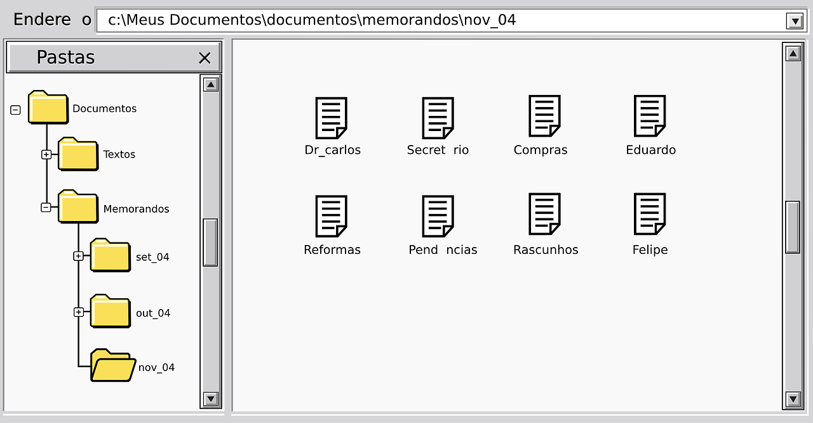

Bienvenido a este blog en el que se presentarán las diversas prácticas realizadas en la asignatura de "CIU". El objetivo de esta asignatura es desarrollar aplicaciones cuyas interfaces de usuario aprovechen de buena manera la conexión que hay entre la máquina y el usuarios, empleando para ello herramientas como "Processing", "P5.js", "Arduino", entre otros.

## Enunciado de prácticas

[Enunciados de prácticas](https://ncvt-aep.ulpgc.es/cv/ulpgctp21/pluginfile.php/412240/mod_resource/content/37/CIU_Pr_cticas.pdf).

